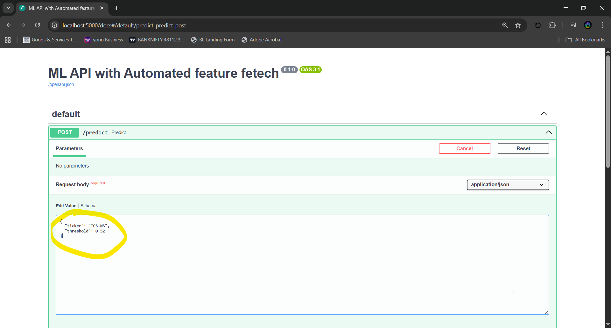

Step 1. Running API.

```

python api_app.py

```

Step 2. Using Windows Command Line.

```

curl -X 'POST' \
  'http://localhost:5000/predict' \
  -H 'accept: application/json' \
  -H 'Content-Type: application/json' \
  -d '{
  "ticker": "string",
  "threshold": float
}'

```

- refer [PROBA_THRES.md](PROBA_THRES.md) for the threshold parameter and response guide.

Step 5. Fast API Web Guide.
```

http://localhost:5000/docs

```
- you will be directed to fastapi created UI which will look like this. 


Step 6. After pressing Try it out.
- There will be two parameter which is required to fill. For sample i have filled.



* First parameter ticker which require ticker.
* Secound paramter threshold refer [PROBA_THRES.md](PROBA_THRES.md)

Step 7. Response.


Step 8 - Whole UI-
- Note: you have to first make api_app.py live then run this script

```
streamlit run app.py

```
